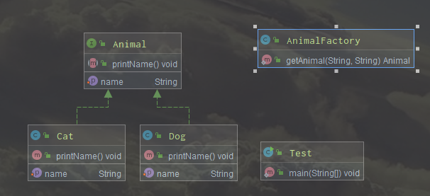

# 工厂模式 Factory Pattern

类型 ： 创建型模式

## 介绍
### 意图
定义一个创建对象的接口，让其子类自己决定实例化哪一个工厂类，工厂模式使其创建过程延迟到子类进行。
### 优点
1. 一个调用者想创建一个对象，只要知道其名称就可以了。
2. 扩展性高，如果想增加一个产品，只需要扩展一个工厂类就可以。
3. 屏蔽产品的具体实现，调用者只关心产品的接口。
### 缺点
1. 每次增加一个产品时，都需要增加一个具体类和对象实现工厂，使得系统中类的个数成倍增加，增加了复杂度。
### 角色
#### 工厂 - Factory
用来生成具体类的工厂
#### 接口 - 抽象
通过定义接口，让工厂可以确定返回值，也可以是某个抽象类
#### 实体类 - 实现接口由工厂产生
实现类实现接口或继承抽象类，工厂返回接口就可以返回其实现类，是一个具体的类

## 例图

上面例图中的代码-[测试类](codes/Test.java)